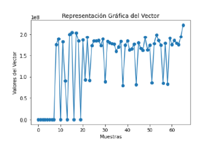
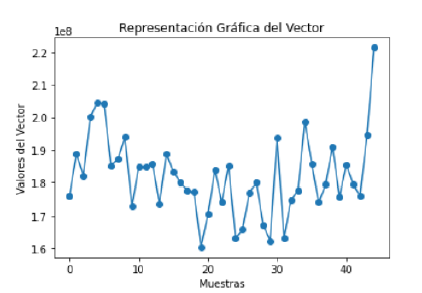
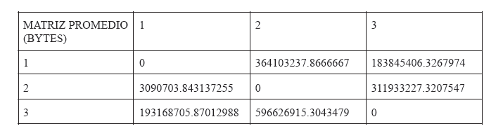
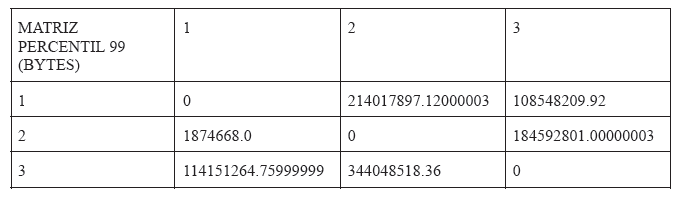

# MikroTik Network Traffic Analysis

An academic networking project focused on the deployment, configuration and analysis of a multi-router network infrastructure using MikroTik RouterOS.

The project combines static routing, NetFlow traffic monitoring, Linux networking tools, Bash automation, Python data analysis and traffic engineering techniques to analyze network behavior and optimize network capacity based on measured traffic matrices.

---

# Project Overview

The objective of this project was to deploy, configure and validate a laboratory network while learning traffic engineering concepts through real traffic measurements.

The infrastructure includes:

- Multi-router MikroTik topology
- Three interconnected LANs
- Static IPv4 routing
- Linux-based administration
- NetFlow v9 monitoring
- Traffic generation using iperf
- Bash automation
- Python traffic analysis
- Traffic engineering
- Network optimization using GNU Octave and GLPK

---

# Features

- MikroTik RouterOS Configuration
- Static Routing
- IPv4 Addressing
- SSH Administration
- NetFlow v9 Monitoring
- Traffic Flow Export
- Linux Networking
- Traffic Generation with iperf
- Bash Automation
- Python Data Processing
- Traffic Matrix Generation
- Traffic Engineering
- Network Optimization

---

# Technologies

| Category | Technologies |
|-----------|--------------|
| Routing | MikroTik RouterOS |
| Monitoring | NetFlow v9, Traffic Flow |
| Network Tools | iperf, nfcapd, nfdump |
| Operating System | Ubuntu Linux |
| Automation | Bash |
| Programming | Python |
| Data Analysis | NumPy, Matplotlib |
| Optimization | GNU Octave, GLPK |
| Protocols | IPv4, SSH |

---

# Network Topology

Complete laboratory topology used throughout the project.


---

# Repository Structure

```text
mikrotik-network-traffic-analysis/
│
├── docs/
│   ├── 01-project-overview.md
│   ├── 02-network-architecture.md
│   ├── 03-ip-addressing.md
│   ├── 04-mikrotik-configuration.md
│   ├── 05-network-services.md
│   ├── 06-traffic-monitoring.md
│   ├── 07-python-automation.md
│   └── 08-network-validation.md
│
├── scripts/
│   ├── configure-gateway.sh
│   ├── configure-netflow.sh
│   ├── configure-netflow-export.sh
│   ├── configure-routes.sh
│   ├── export-netflow.sh
│   ├── iperf-client.sh
│   ├── iperf-server.sh
│   ├── start-nfcapd.sh
│   ├── traffic-client.sh
│   └── traffic-server.sh
│
├── screenshots/
│   ├── topology.png
│   ├── traffic-average.png
│   ├── traffic-percentile99.png
│   ├── average-traffic-matrix.png
│   └── percentile99-traffic-matrix.png
│
├── README.md
└── LICENSE
```

---

# Documentation

| Document | Description |
|----------|-------------|
| 01 - Project Overview | Project objectives, scope and traffic engineering goals |
| 02 - Network Architecture | Network topology, devices and infrastructure |
| 03 - IP Addressing | IPv4 addressing plan and subnet allocation |
| 04 - MikroTik Configuration | RouterOS configuration, routing and NetFlow setup |
| 05 - Network Services | SSH administration, traffic generation and Linux services |
| 06 - Traffic Monitoring | NetFlow collection, traffic analysis and measured data |
| 07 - Python Automation | Traffic processing, statistics and visualization |
| 08 - Network Validation | Connectivity tests, troubleshooting and validation |

---

# Project Highlights

## Network Topology

Laboratory infrastructure composed of multiple MikroTik routers interconnected through three LANs.


---

## Average Traffic Analysis

Traffic collected through NetFlow was processed with Python to estimate the average traffic demand used for traffic engineering.



---

## 99th Percentile Analysis

Traffic measurements were analyzed using the 99th percentile methodology to estimate peak network demand while filtering short-lived traffic spikes.



---

## Average Traffic Matrix

Traffic engineering matrix generated from average traffic measurements.



---

## 99th Percentile Traffic Matrix

Traffic engineering matrix generated using the 99th percentile methodology for network capacity planning.



---

# Learning Outcomes

This project provided hands-on experience with:

- MikroTik RouterOS
- Static IPv4 Routing
- Linux Network Administration
- SSH Remote Management
- NetFlow Traffic Monitoring
- Bash Automation
- Python Data Processing
- Traffic Matrix Analysis
- Traffic Engineering
- GNU Octave and GLPK Optimization
- Network Performance Evaluation

---

# Repository Contents

- Complete technical documentation
- MikroTik RouterOS configuration
- Bash automation scripts
- Python traffic analysis scripts
- GNU Octave optimization files
- Network topology screenshots
- Traffic analysis results
- Traffic engineering matrices
- Network validation documentation
