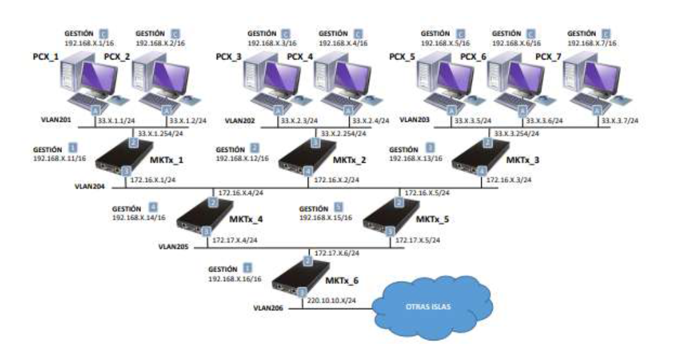

# Network Architecture

## Architecture Overview

This project implements a laboratory multi-site network using MikroTik RouterOS. The environment is organized as an isolated network ("Island") where several LANs are interconnected through a backbone of routers. Since the laboratory has no Internet access, all software packages are provided by a local repository server.

The architecture separates the management network from the production data network, allowing devices to be configured independently of user traffic.

---

## Network Topology

The infrastructure consists of three Local Area Networks (LANs) connected through six MikroTik routers.

The topology was designed to:

- Connect multiple LANs through routed links.
- Separate management and production traffic.
- Allow traffic generation and monitoring.
- Support traffic engineering experiments.
- Provide a controlled environment for routing and NetFlow analysis.

> **Topology**

---

## Network Segments

### LAN 1

- Hosts:
  - PCX_1
  - PCX_2
- Connected to Router MKTx_1

### LAN 2

- Hosts:
  - PCX_3
  - PCX_4
- Connected to Router MKTx_2

### LAN 3

- Hosts:
  - PCX_5
  - PCX_6
  - PCX_7
- Connected to Router MKTx_3

---

## Backbone Network

Interconnection between LANs is achieved through a backbone formed by additional MikroTik routers.

The laboratory uses several VLANs to separate local access networks from transit networks.

- VLAN201
- VLAN202
- VLAN203
- VLAN204
- VLAN205
- VLAN206

Transit VLANs provide connectivity between routers and towards the remaining islands of the laboratory.

---

## Network Devices

### MikroTik Routers

The network contains six MikroTik RouterOS routers.

| Router | Role |
|---------|------|
| MKTx_1 | Gateway for LAN 1 |
| MKTx_2 | Gateway for LAN 2 |
| MKTx_3 | Gateway for LAN 3 |
| MKTx_4 | Backbone router |
| MKTx_5 | Backbone router |
| MKTx_6 | Boundary router connecting to other islands |

---

### End Hosts

Seven Linux workstations are deployed throughout the network.

These hosts are used to:

- Generate traffic with iperf
- Execute Bash automation scripts
- Collect NetFlow records
- Process captured traffic
- Perform routing validation

---

### Local Repository Server

A local repository server named **Eihal** provides software packages inside the isolated laboratory.

Its purpose is to allow package installation without requiring Internet connectivity.

---

## Management Network

A dedicated management network is used to configure and administer all routers.

Management interfaces use private IPv4 addresses (`192.168.X.X`) and are accessed through SSH.

Separating management traffic from production traffic simplifies administration and avoids losing access during network experiments.

---

## Data Network

Production interfaces carry user-generated traffic between LANs.

Traffic generated by the Linux hosts is forwarded through the MikroTik routers using static routing before being monitored through NetFlow.

---

## Traffic Flow

Communication follows these general steps:

1. Hosts send packets to their default gateway.
2. MikroTik routers inspect the destination network.
3. Static routing determines the next hop.
4. Packets traverse the backbone routers.
5. Traffic reaches the destination LAN.

During the experiments, traffic was generated continuously using iperf to evaluate network behavior.

---

## Design Decisions

Several design choices were made during the implementation:

- Separate management and production networks.
- Use dedicated transit VLANs between routers.
- Centralize software installation through a local repository.
- Automate repetitive configuration tasks using Bash scripts.
- Deploy a topology suitable for traffic monitoring and engineering experiments.

---

## Architecture Summary

| Component | Quantity |
|-----------|---------:|
| LANs | 3 |
| MikroTik Routers | 6 |
| Linux Hosts | 7 |
| Repository Server | 1 |
| Transit VLANs | 6 |
| Management Network | Yes |
| Internet Access | No |
